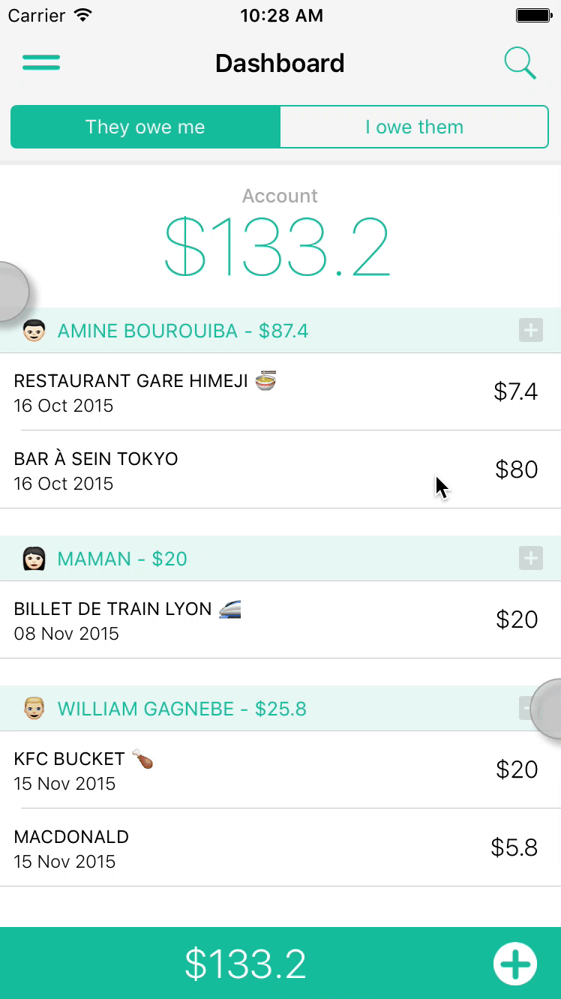

# AWBanner

An easy, customizable and soft swift banner notification for iOS applications.

[](http://cocoapods.org/pods/AWBanner)
[](#)
[](http://cocoapods.org/pods/AWBanner)
[](http://cocoapods.org/pods/AWBanner)



An easy, customizable and soft swift banner notification for iOS applications.
AWBanner library provides an easy to use class to show a banner view on the screen ( wherever you want, you can specify the Y origin ).

The banner moves from the Y origin ( default 0, but you can change it 👍) and stays there until the duration you choose elapse ( Personally I choose in general 2.5s ).
To dismiss the banner before the time elapse, the user can tap it.

## Requirements

```swift
guard ios >= 7 else { return }
```

## Installation

### Cocoapods

AWBanner is available through [CocoaPods](http://cocoapods.org). To install
it, simply add the following line to your Podfile:

```ruby
pod "AWBanner"
```
### Manually

Simply drag and drop the `AWBANNER.swift` file to your project.

## Usage

To show the banner, use the following code :

```swift

AWBanner.showWithDuration(2.5,
delay: 0.0,
message: NSLocalizedString("🕒The reminder has been successfully scheduled.", comment: "Banner title that informs the user the notification has been successfully scheduled"),
backgroundColor: ThemeManager.currentTheme.mainColor,
textColor: UIColor.whiteColor())
}

// Or if you want to choose where it comes from, add the last parameter yOrigin, like :

AWBanner.showWithDuration(2.5,
delay: 0.0,
message: NSLocalizedString("🕒The reminder has been successfully scheduled.", comment: "Banner title that informs the user the notification has been successfully scheduled"),
backgroundColor: ThemeManager.currentTheme.mainColor,
textColor: UIColor.whiteColor(),
originY: 40.0)
}
```
## Author

Rebouh Aymen, aymenworks@gmail.com

Twitter [@aymenworks](https://twitter.com/aymenworks)

## License

AWBanner is available under the MIT license. See the LICENSE file for more info.
